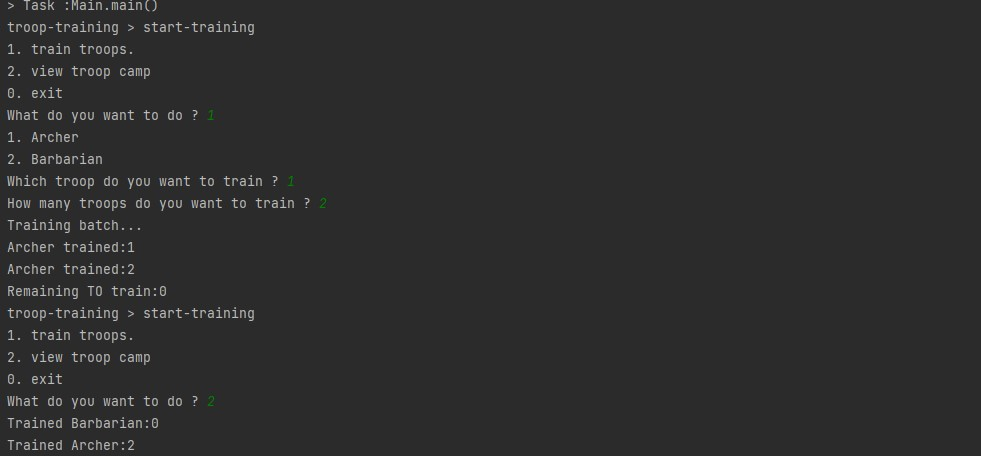
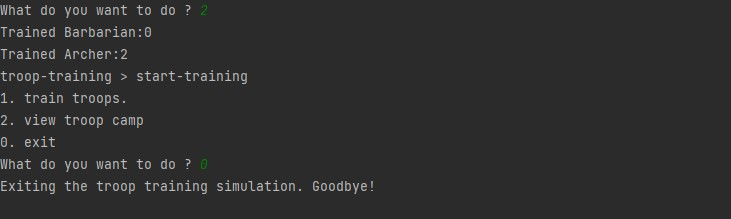

# Troop Training Simulation

## Problem Statement

Troop training simulation is inspired by Clash of Clans games. As a gaming programmer, you have to create a simulation software using which gamers can train army troops.

### Army Troops

There are two kinds of troops: Archers and Barbarians. Each trooper (archer/barbarian) has the following characteristics:

- *Barbarian* (Weapon: Sword)
    - Training Time (seconds): 3
    - Training Cost (magic potions): 10

- *Archer* (Weapon: Bow and Arrow)
    - Training Time (seconds): 6
    - Training Cost (magic potions): 20

### Barracks

Barracks are where each trooper gets trained. The following rules apply to barracks:
- Only one trooper can be trained at a given point of time.
- The maximum seat capacity of a barracks is 10.
- Others have to wait outside the barracks.
- Barracks can have a mix of troopers, e.g., 5 Archers and 5 Barbarians, or 4 Archers and 6 Barbarians, or 10 Archers, or 10 Barbarians.

### Army Camp

The army camp is where troops assemble after training.

## Scenario 1

Simulate the training and train barbarians and/or archers. As a gamer:

1. You should be able to input the number of barbarians and/or archers you would like to train.
2. You should be able to see how many troops are trained and available in the troop camp after training completes.

# OOMD Analysis

---

Domain:

Model:

Archer:

     States:
     - int id;
     - int trainingTime
     - int trainingCost
     Behaviour:
     - getId()
     - getTrainingTime()
     - getTrainingCost()

Barbarian:

     States:
     - int id;
     - int trainingTime
     - int trainingCost
     Behaviour:
     - getId()
     - getTrainingTime()
     - getTrainingCost()

Service:

    Train:
    
      states:
      - private final int maxCapacity;
      - private final InMemoryTrooperRepository;
      - private final InMemoryTrainedTroopRepository;
      Behaviour:
      - public boolean TrainTroops();
      - public void TrainedTroopsByType();

Enum:

    Troop
      - Barbarian 
      - Archer

Controller:

BarrackController:

states:
- private final InMemoryTrooperRepository;
- private  final BarrackService;

Behaviour:
- public Response train();

TroopController:

states:
- private TroopService;

Behaviour:
- public Response CreateTroop(int troopCount,String TroopType);

Service:

BarrackService:

States:
- private final InMemoryTrooperRepository;
- private final InMemoryTrainedTrooperRepository;
- private final Train;

Behaviour:
- public boolean TrainTroopers(List<Troopers>);

TroopService:

States:
- private final TroopRepository;

Behaviour:
- public void create(int troopCount,String TroopType);

Exceptions:
- Exception regarding type and count.

Validator:
- Validates TroopType and Count.

Repository:
- InMemoeryTrooperRepository
- InMemoryTrainedTrooperRepository

Database:
- FakeDatabase

Dependency Module:
- TroopModule

Used Design Pattern :
- Dependency Injection

Future Impelementation:
- Utilize the Trainig cost To Train the Trooper.

Main Class Output:

